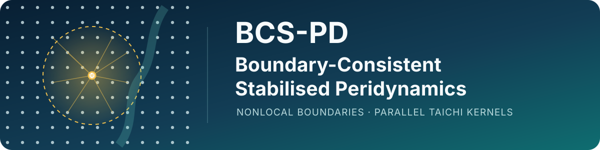
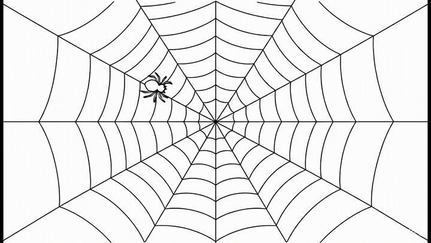
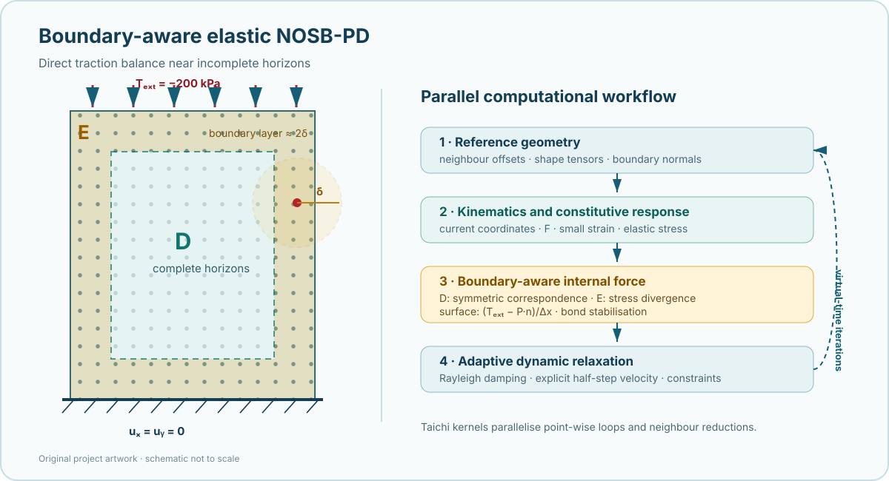
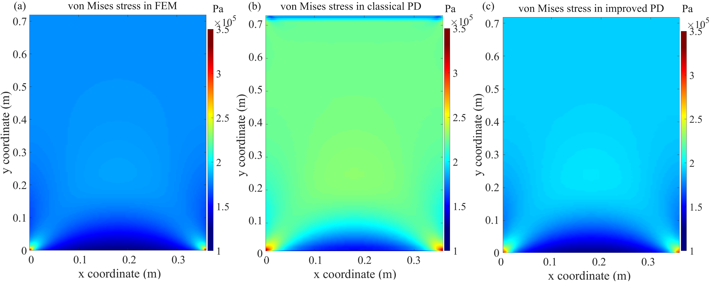
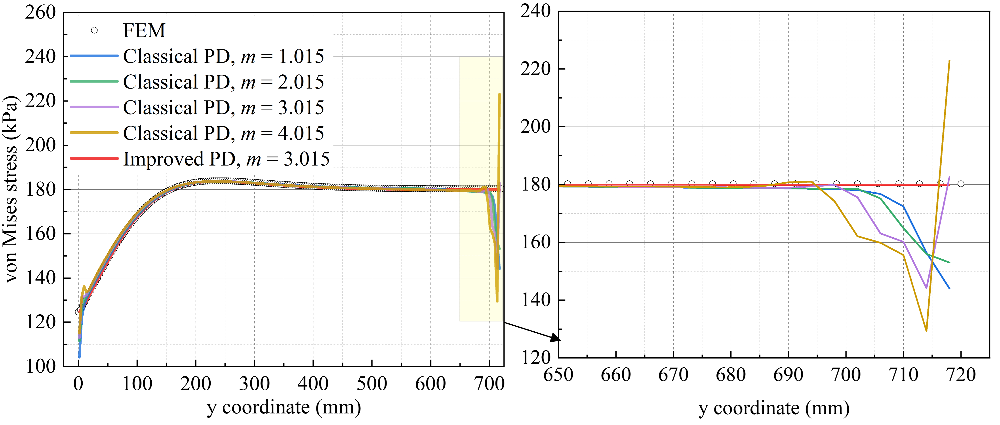

<div align="center">



# BCS-PD

**A Parallel Boundary-Consistent Stabilised Peridynamics Framework**

[](https://www.python.org/)
[](https://www.taichi-lang.org/)
[](LICENSE)

</div>

BCS-PD implements small-strain elastic NOSB-PD with boundary correction and
zero-energy-mode stabilisation. [Taichi](https://www.taichi-lang.org/)
parallelises material-point and neighbourhood operations on CPUs and GPUs.

Near incomplete horizons, a nonlocal stress-divergence operator replaces the
conventional correspondence force. The outermost point layer includes the
prescribed traction and stress-normal contribution directly, supporting zero
and non-zero tractions without ghost layers or equivalent body loads.

## A visual analogy for nonlocal interaction

A spider senses disturbances transmitted through its web. Similarly, a
peridynamic point interacts with other points within a finite horizon. This is
an illustration of nonlocality, not a physical model.

<p align="center">
  <a href="https://github.com/YIXINLI921/bcs-pd/raw/refs/heads/main/assets/videos/spider-nonlocal-interaction.mp4">
    
  </a>
</p>

<p align="center"><em>Click to open the MP4.</em></p>

## Project status

Developed within the **School of Engineering, University of Warwick, UK**.
Copyright © 2026 University of Warwick. The code originated in 2024 and remains
under active development.

> **Scope.** Version 0.1.0 covers 2-D plane-strain linear elasticity,
> zero-energy-mode stabilisation, boundary-layer stress-divergence correction,
> direct traction treatment, and adaptive dynamic relaxation. See
> [Model scope](docs/model-scope.md).

## Purpose

Classical correspondence NOSB-PD may develop residual forces near truncated
horizons, affecting stress and displacement fields. This project provides an
inspectable elastic implementation for boundary-condition studies,
stabilisation development, and later multiphysics extensions.

## Method at a glance

<p align="center">
  
</p>

The interior uses the symmetrised correspondence force. Within `2δ` of a
boundary, the solver evaluates a nonlocal stress divergence; at the surface,
`T_ext` and `P·n` complete the force balance. A bond-level term stabilises
deformation modes not represented by the nodal deformation gradient. Explicit
adaptive dynamic relaxation (ADR) computes the quasi-static response.

## Installation

Install the project in a clean Python environment:

```bash
git clone https://github.com/YIXINLI921/bcs-pd.git
cd bcs-pd
python -m venv .venv
source .venv/bin/activate
python -m pip install --upgrade pip
python -m pip install -e ".[test]"
```

Simulation fields are stored as portable NumPy arrays and can be converted to
VTK/VTU for post-processing in [ParaView](https://www.paraview.org/).

## Elastic plate benchmark: boundary-effect correction

The classical formulation develops an artificial high-stress band near the
loaded upper boundary. The improved boundary treatment removes this artefact
and agrees closely with the FEM reference.

<p align="center">
  
</p>

<p align="center"><em>Contours of von Mises stress computed by (a) FEM, (b) classical NOSB-PD, and (c) improved NOSB-PD.</em></p>

Classical solutions depart from FEM near the upper boundary as the horizon
ratio increases; the improved solution remains close to FEM.

<p align="center">
  
</p>

<p align="center"><em>von Mises stress computed using different numerical methods; the right panel magnifies the upper-boundary region.</em></p>

## Use as a Python library

```python
from stabilised_pd import (
    ElasticStabilisedPD,
    SimulationConfig,
    initialise_taichi,
)

config = SimulationConfig.from_json("configs/smoke_test.json")
initialise_taichi(config)
model = ElasticStabilisedPD(config)
result = model.run(steps=10)

print(result.max_displacement)
print(result.stress[config.sample_index])
```

Taichi is process-global, so call `initialise_taichi` once before constructing
the first model. For parameter sweeps that require different backends or
precisions, launch each configuration in a separate process.

## Reference configuration

The archived configuration defines a rectangular plane-strain compression test:

| Quantity | Value |
|---|---:|
| Width × height | 0.36 m × 0.72 m |
| Material points | 50 × 100 |
| Young's modulus | 30 MPa |
| Poisson's ratio | 0.25 |
| Horizon ratio, `m = δ/Δx` | 3.015 |
| Top traction | −200 kPa |
| Bottom boundary | fixed in both directions |
| Side boundaries | traction-free |

Automated FEM comparison and mesh/horizon convergence remain open verification
tasks; see [Verification and reproducibility](docs/verification.md).

## Limitations

This is research software, not a certified engineering analysis package.
Design or safety-critical use requires independent verification, convergence
studies, and confirmation of the dimensional and loading assumptions.

Current limitations include a uniform Cartesian grid, rectangular 2-D geometry,
plane strain, small strain, constant isotropic elasticity, cubic representative
volume inherited from the original implementation, and quasi-static ADR. The
GPU option depends on the backends supported by the local Taichi installation;
double precision may be slower or unavailable on some devices.

## Roadmap

- [ ] automated FEM/reference-solution comparison for the elastic plate;
- [ ] `m`- and `δ`-convergence study driver with uncertainty summaries;
- [ ] configurable geometry and boundary sets;
- [ ] load stepping and convergence-based ADR stopping;
- [ ] objective stress integration for finite rotation;
- [ ] native VTK/VTU export for ParaView post-processing;
- [ ] extensible material, interaction, and multiphysics interfaces.

The framework can be extended to computational plasticity, fracture, fluids,
and fluid–structure interaction. Each extension requires dedicated verification.

## Citation

[CITATION.cff](CITATION.cff) provides machine-readable citation metadata.

### Recommended citation

> University of Warwick. (2026). *BCS-PD: A Parallel Boundary-Consistent
> Stabilised Peridynamics Framework* (Version 0.1.0) [Computer software].
> GitHub. https://github.com/YIXINLI921/bcs-pd

If a permanent software DOI is assigned to a release, cite the archived release
DOI in place of the GitHub URL.

## Simulation gallery

The [simulation gallery](docs/gallery.md) presents five animation groups covering
nonlocal interaction, horizon sensitivity, fracture and strain localisation,
an exploratory fluid calculation, and a compressed perforated plate.

## License

The software is released under the [MIT License](LICENSE). Third-party
dependencies and references retain their own copyright and licences.
