# Simulation gallery

Five demonstration groups are provided as H.264 MP4 files with poster frames.
They illustrate numerical behaviour and are not validation cases.

## 1. Spider-web analogy for nonlocal interaction

[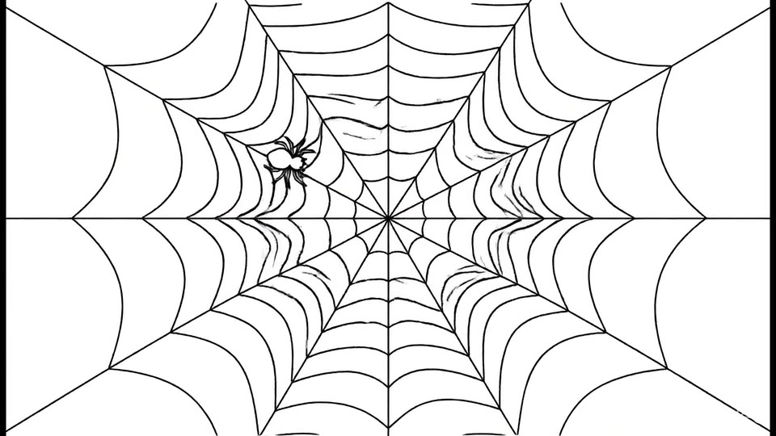](https://github.com/YIXINLI921/bcs-pd/raw/refs/heads/main/assets/videos/spider-nonlocal-interaction.mp4)

**[Open animation](https://github.com/YIXINLI921/bcs-pd/raw/refs/heads/main/assets/videos/spider-nonlocal-interaction.mp4)**

A spider senses motion transmitted through its web. The animation illustrates
finite-range interaction in peridynamics, where a disturbance affects points
within a connected neighbourhood. It is an analogy, not a physical model.

## 2. Horizon-size influence on shear-band propagation

The simulations use the same point distribution and spacing but different
horizon sizes. Because the source files do not include a complete parameter
record, the cases are labelled A–C without numerical horizon values.

| Case A | Case B | Case C |
|---|---|---|
| [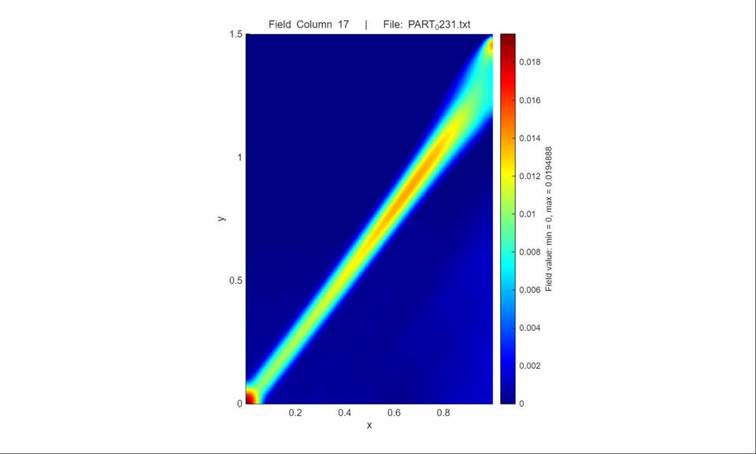](https://github.com/YIXINLI921/bcs-pd/raw/refs/heads/main/assets/videos/horizon-case-a.mp4) | [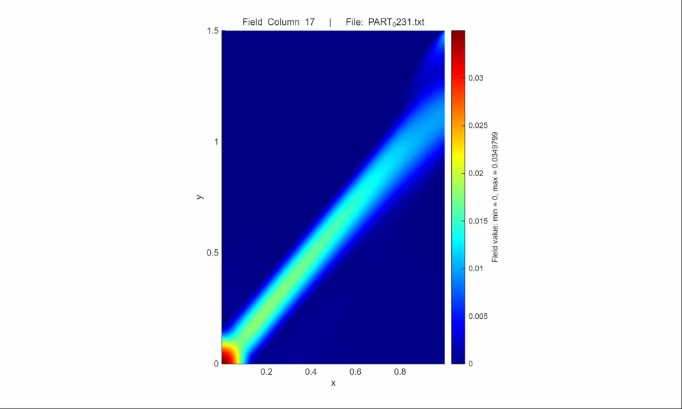](https://github.com/YIXINLI921/bcs-pd/raw/refs/heads/main/assets/videos/horizon-case-b.mp4) | [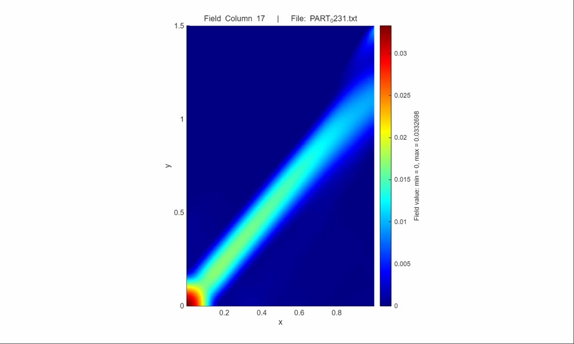](https://github.com/YIXINLI921/bcs-pd/raw/refs/heads/main/assets/videos/horizon-case-c.mp4) |
| [Open animation](https://github.com/YIXINLI921/bcs-pd/raw/refs/heads/main/assets/videos/horizon-case-a.mp4) | [Open animation](https://github.com/YIXINLI921/bcs-pd/raw/refs/heads/main/assets/videos/horizon-case-b.mp4) | [Open animation](https://github.com/YIXINLI921/bcs-pd/raw/refs/heads/main/assets/videos/horizon-case-c.mp4) |

This is a qualitative sensitivity comparison. A convergence study would also
require exact horizons, spacing, loading history, constitutive parameters, and
error measures.

## 3. Pre-cracked rock under uniaxial compression

These two animations show the evolution of fracture and equivalent plastic
strain in a rock specimen under uniaxial compression. The calculation uses a
Drucker–Prager constitutive model.

> **Geometry note:** the locations of the pre-existing cracks are not drawn in
> the rendered field animations. The central rock-bridge angle is **90°**.

| Fracture development | Equivalent plastic strain |
|---|---|
| [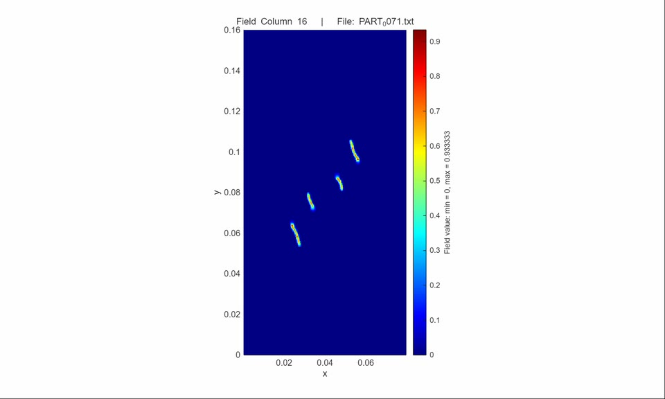](https://github.com/YIXINLI921/bcs-pd/raw/refs/heads/main/assets/videos/precracked-rock-fracture.mp4) | [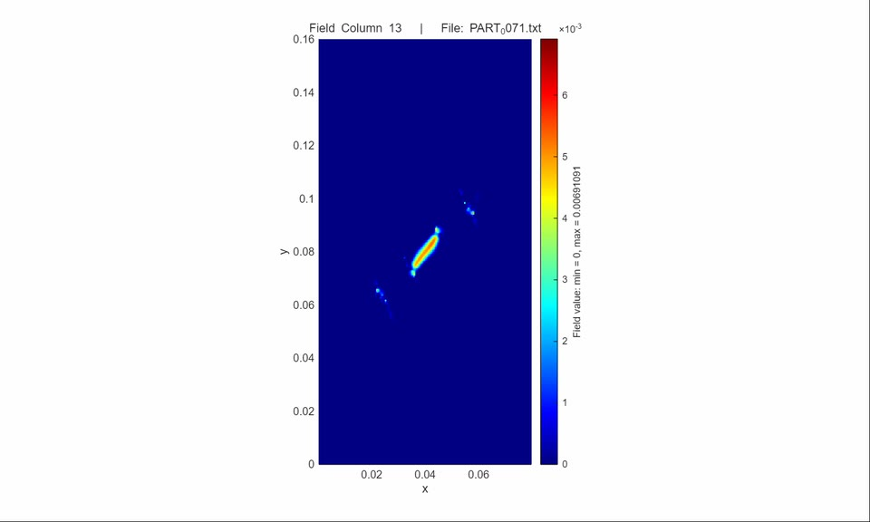](https://github.com/YIXINLI921/bcs-pd/raw/refs/heads/main/assets/videos/precracked-rock-plastic-strain.mp4) |
| [Open animation](https://github.com/YIXINLI921/bcs-pd/raw/refs/heads/main/assets/videos/precracked-rock-fracture.mp4) | [Open animation](https://github.com/YIXINLI921/bcs-pd/raw/refs/heads/main/assets/videos/precracked-rock-plastic-strain.mp4) |

## 4. Exploratory fluid dam-break simulation

[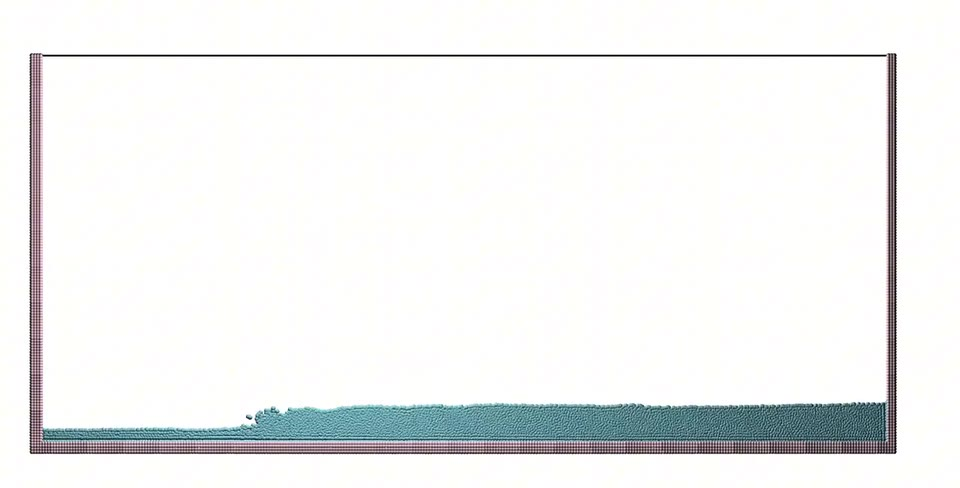](https://github.com/YIXINLI921/bcs-pd/raw/refs/heads/main/assets/videos/fluid-dam-development.mp4)

**[Open animation](https://github.com/YIXINLI921/bcs-pd/raw/refs/heads/main/assets/videos/fluid-dam-development.mp4)**

This early dam-break trial is under development and is not a validated fluid
benchmark.

## 5. Compressed plate with a central opening

These four animations show the response of a centrally perforated plate under
compression. The calculation uses a Drucker–Prager constitutive model.

> **Geometry note:** the central opening is not explicitly drawn in the rendered
> field animations; its influence is visible through the surrounding field
> patterns.

| x-displacement | y-displacement |
|---|---|
| [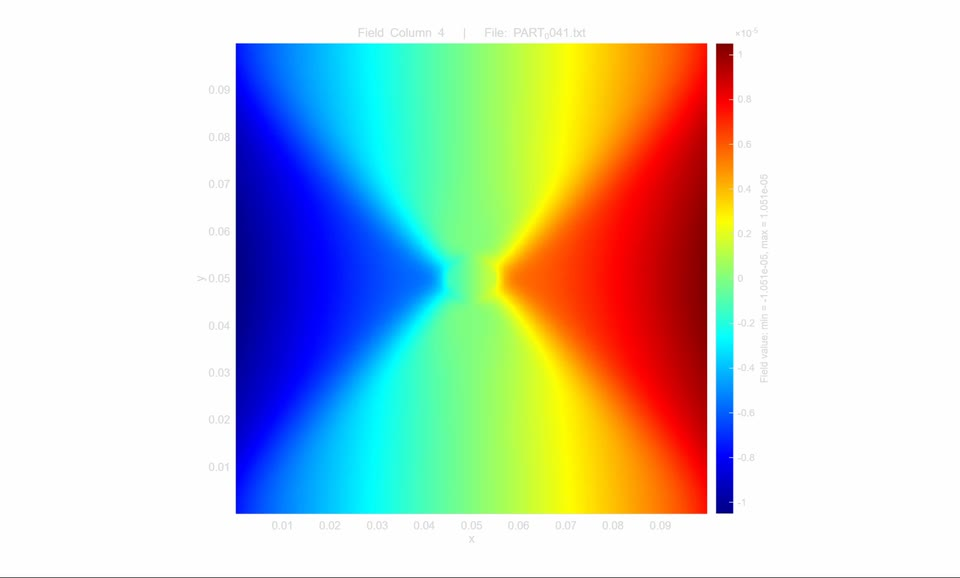](https://github.com/YIXINLI921/bcs-pd/raw/refs/heads/main/assets/videos/perforated-plate-x-displacement.mp4) | [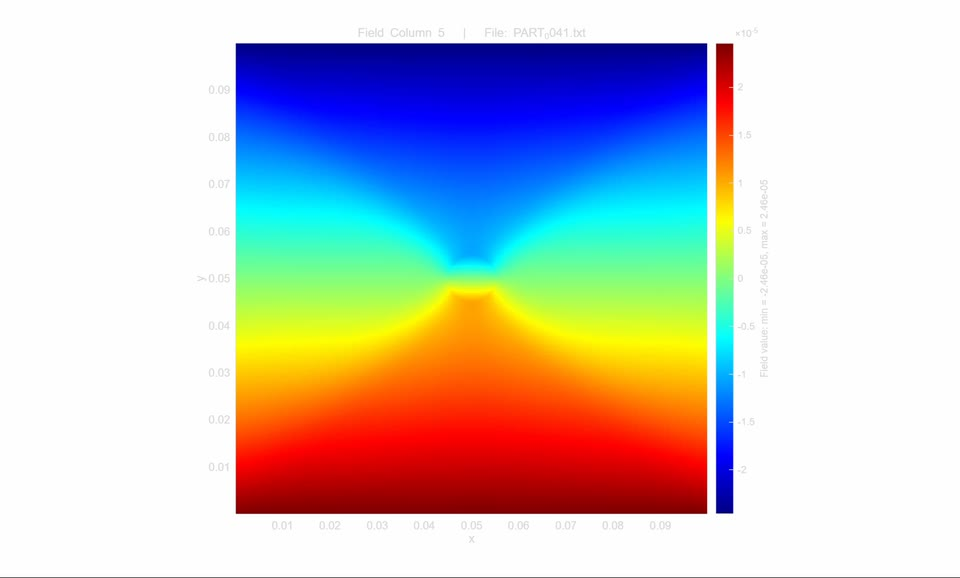](https://github.com/YIXINLI921/bcs-pd/raw/refs/heads/main/assets/videos/perforated-plate-y-displacement.mp4) |
| [Open animation](https://github.com/YIXINLI921/bcs-pd/raw/refs/heads/main/assets/videos/perforated-plate-x-displacement.mp4) | [Open animation](https://github.com/YIXINLI921/bcs-pd/raw/refs/heads/main/assets/videos/perforated-plate-y-displacement.mp4) |

| von Mises stress | Equivalent plastic strain |
|---|---|
| [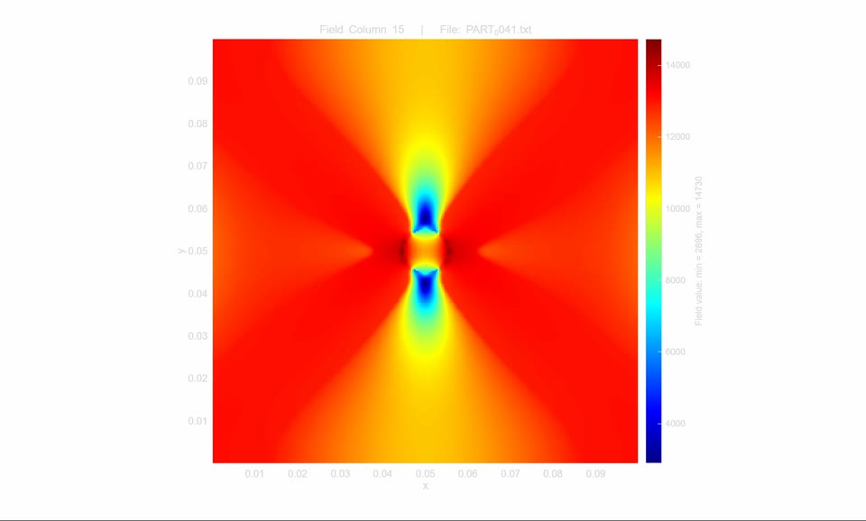](https://github.com/YIXINLI921/bcs-pd/raw/refs/heads/main/assets/videos/perforated-plate-von-mises-stress.mp4) | [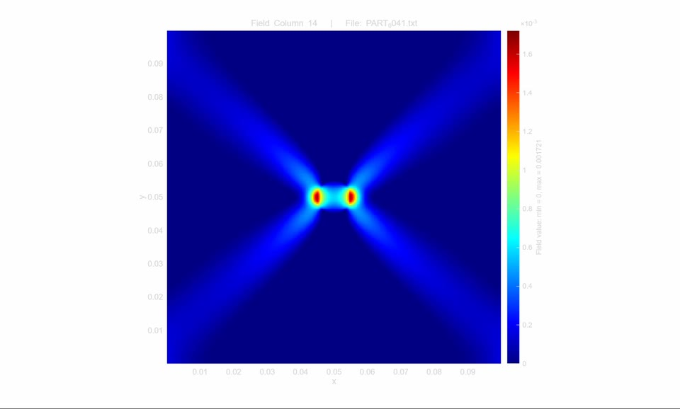](https://github.com/YIXINLI921/bcs-pd/raw/refs/heads/main/assets/videos/perforated-plate-equivalent-plastic-strain.mp4) |
| [Open animation](https://github.com/YIXINLI921/bcs-pd/raw/refs/heads/main/assets/videos/perforated-plate-von-mises-stress.mp4) | [Open animation](https://github.com/YIXINLI921/bcs-pd/raw/refs/heads/main/assets/videos/perforated-plate-equivalent-plastic-strain.mp4) |
